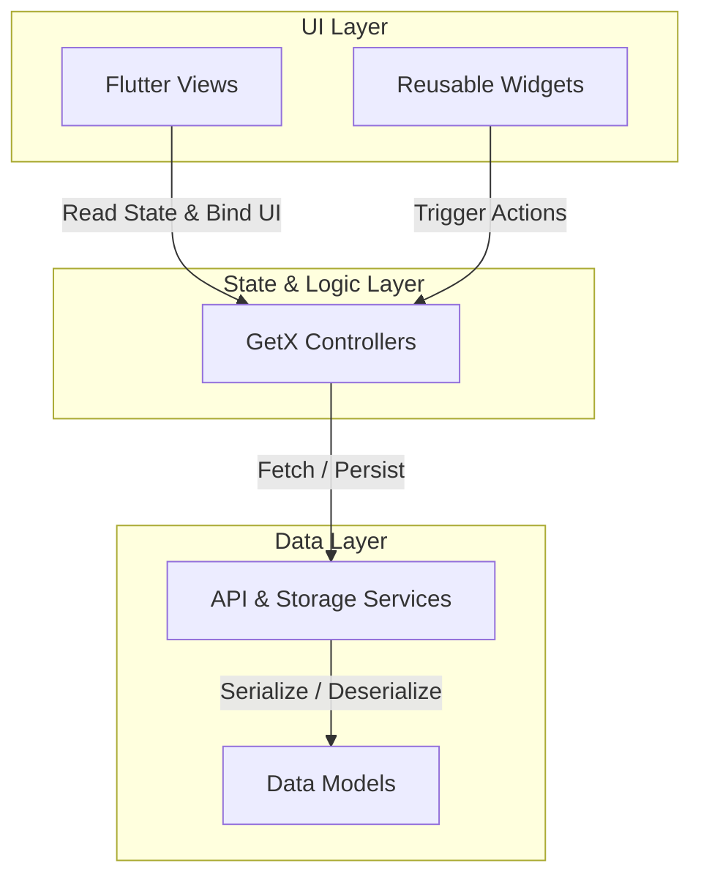

# Sputify - Modern Music Discovery & Playback

[](https://flutter.dev)
[](https://dart.dev)
[](#)
[](https://pub.dev/packages/flutter_lints)
[](#)

Sputify is a modern, high-performance music streaming application built using the Flutter framework. It offers a premium audio discovery and playback experience, featuring animated linear gradients, modern glassmorphic card designs, smooth micro-interactions, and a reactive dark/light theme system.

---

## 🎨 Design Philosophy & UX Highlights

Sputify is designed to be visually stunning, responsive, and tactile. Key design details include:

- **Rich Palette & Dark Mode First**: Default premium dark mode designed with a midnight blue canvas (`0xFF0A1628`) and high-contrast blue (`0xFF2196F3`) accent colors.
- **Glassmorphism Card Effects**: Translucent cards utilizing blurred backdrops and opacity constraints (`withValues(alpha: 0.6)`) to present clean hierarchy.
- **Dynamic Micro-Animations**: Smooth scale/fade transformations (`TweenAnimationBuilder`), rotating artwork headers in the player view, and sliding navigation drawers to make the app feel alive.

---

## 🏗️ Architecture Design (MVVM with GetX)

The project strictly follows the **Model-View-ViewModel (MVVM)** pattern, leveraging **GetX** for reactive state management, dependency injection, and clean, context-free routing.



### 📂 Directory Layout

```
lib/
├── main.dart                 # Initialization, global dependency registration & root app setup
├── models/
│   └── song_model.dart       # Song data structure with JSON parser & high-res image mapper
├── routes/
│   └── app_pages.dart        # GetX path mapping and route declarations
├── services/
│   ├── api_service.dart      # HTTP integration with the iTunes Search API with timeout & retry logic
│   └── storage_service.dart  # Shared Preferences persistent favorites database
├── controllers/
│   ├── music_controller.dart    # Music catalog, genre loading, search operations, and favorites syncing
│   ├── player_controller.dart   # Playback state, playlists, repeat, shuffle, and audio quality modifiers
│   ├── theme_controller.dart    # Dark/Light theme configuration and SharedPreferences syncing
│   └── settings_controller.dart # Shared preferences storage configuration (notifications, cache size)
├── views/
│   ├── splash_view.dart      # Dynamic logo introduction with auto-navigation
│   ├── home_view.dart        # Trending tracks listing, header wave animations, drawer anchor
│   ├── search_view.dart      # Real-time interactive query input with instant result updates
│   ├── player_view.dart      # Complete control center: seeking, volume sliders, looping, artwork spinner
│   ├── favorites_view.dart   # Filtered list of persistent starred tracks with empty state widgets
│   ├── settings_view.dart    # Audio resolution, toggle permissions, cache cleanup simulation
│   └── about_view.dart       # Detailed app license information and developer details
└── widgets/
    ├── app_drawer.dart       # Custom animated navigation panel with slide-in scale effects
    └── mini_player.dart      # Persistent overlay bottom sheet with tap-to-expand controls
```

---

## 🚀 Key Features

* **Real-time Search & Discovery**: Uses the public iTunes Search API. Implements automated 3-stage HTTP retries for resilient catalog loading.
* **Full-featured Audio Player**: Seamless playback using `audioplayers`, featuring real-time seek sliders, duration calculations, track skipping, and background state preservation.
* **Persistent Favorites Database**: One-tap favoriting backed by local key-value serialization (`SharedPreferences`), synced reactively across all screens.
* **Advanced Player State Engine**: Supports multiple repeat modes (`Off`, `One`, `All`) and intelligent shuffle history tracking (prevents repeating tracks until the full queue has completed).
* **Audio Quality Engine**: Simulates adjustments of audio bandwidth output (Low, Medium, High, Very High) bound directly to output hardware volume constraints.
* **Clean & Secure Release Setup**: Custom `.gitignore` excludes local compiler properties, `.vscode` workspace flags, keystores, and credentials.

---

## 🛠️ Getting Started & Installation

### Prerequisites

- [Flutter SDK](https://docs.flutter.dev/get-started/install) (`>= 3.10.4`)
- [Dart SDK](https://dart.dev/get-started) (`>= 3.0.0`)
- Android Studio / VS Code / Xcode configured for Flutter development.

### Setup Instructions

1. **Clone the repository**
   ```bash
   git clone https://github.com/yourusername/music_streaming_app.git
   cd music_streaming_app
   ```

2. **Retrieve project dependencies**
   ```bash
   flutter pub get
   ```

3. **Verify analyzer checklist**
   ```bash
   flutter analyze
   ```

4. **Execute the test suite**
   ```bash
   flutter test
   ```

5. **Launch the application in debug mode**
   ```bash
   flutter run
   ```

---

## 🛡️ Security & Privacy Audits

Sputify conforms to standard privacy guidelines:
- **No Hardcoded Credentials**: Third-party APIs are public. No private endpoints or API tokens are checked into the codebase.
- **Sensitive Configurations Excluded**: All project properties (`local.properties`), keystores (`*.keystore`, `*.jks`), and OS-specific build environments (`Generated.xcconfig`, `.vscode/`) are configured directly in `.gitignore` to prevent accidental leakages.

---

## 👥 Developers

This project was developed by:
1. **Didar Ibrahim**
2. **Ayad Lateef**
3. **Sahand Salih**

---

## 📄 License

This project is licensed under the MIT License.
